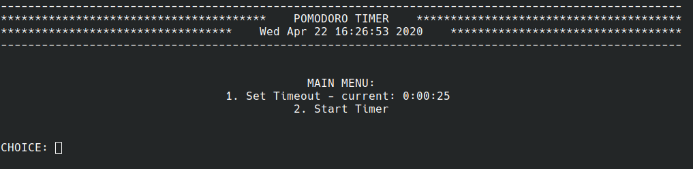

# 001 Pomodoro Timer

## Overview
A simple project that makes use of the datetime library to count down a set number of minutes. 
you can find out more about the [Pomodoro Technique here.](https://en.wikipedia.org/wiki/Pomodoro_Technique)

## Languages
   - Python 3.7.5
   
## Libraries / Frameworks
   - datetime (built in)

## Screenshots

#### Menu

#### Set Time

#### Timer running

#### Time's up
