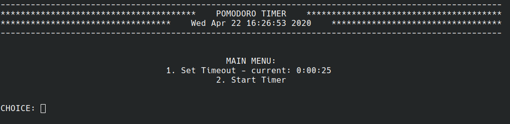

# 100 Applications
These programs are writen to improve coding skills by creating small applications.

[1. Pomdoro Timer](001_Pomodoro_timer)

A simple project that makes use of the datetime library to count down a set number of minutes. 

 